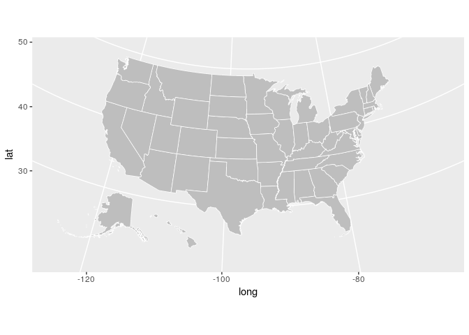
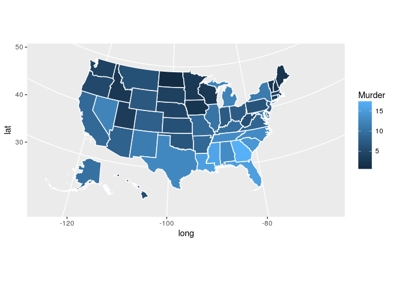

<!-- README.md is generated from README.Rmd. Please edit that file -->
uimapr
======

The `uimapr` package provides state and county shapefiles in 'tibble' format that is compatible to map with 'ggplot2'.

Shapefiles include Alaska and Hawaii, transformed to be displayed as insets within the continental United States.

This package is heavily inspired by and derived in part from the [fiftystater package](https://cran.r-project.org/package=fiftystater) by William Murphy.

Installation
------------

You can install the latest version of `uimapr` from GitHub:

``` r
# install.packages(devtools)
# devtools::install_github('UrbanInstitute/uimapr')
```

Usage
-----

`uimapr` contains two `tibble` dataframes:

-   `states`
-   `counties`

The `states` and `counties` tibbles can be used with `geom_polygon()` and `coord_map()` to create base maps of the continental United States, with Alaska and Hawaii displayed as insets:

``` r
library(ggplot2)
library(dplyr)
library(tibble)
library(magrittr)
library(uimapr)

states %>%
  ggplot(aes(long, lat, group = group)) +
   geom_polygon(fill = "grey", color = "#ffffff", size = 0.25) +
   coord_map(projection = "albers", lat0 = 39, lat1 = 45)
```



Merging Data
------------

The `states` and `counties` tibbles include various identifiers to make merging data easy, which can then be piped into `ggplot2` to create a choropleth map:

``` r
USArrests %>%
  rownames_to_column('state_name') %>%
  select(state_name, Murder) %>%
  left_join(states, by = 'state_name') %>%
  ggplot(aes(long, lat, group = group, fill = Murder)) +
   geom_polygon(color = "#ffffff") +
   coord_map(projection = "albers", lat0 = 39, lat1 = 45)
```


