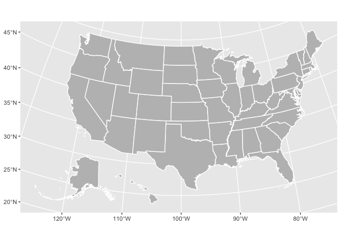
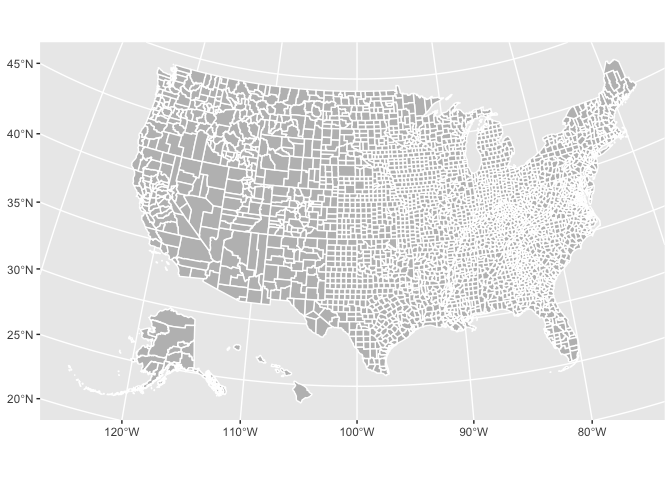
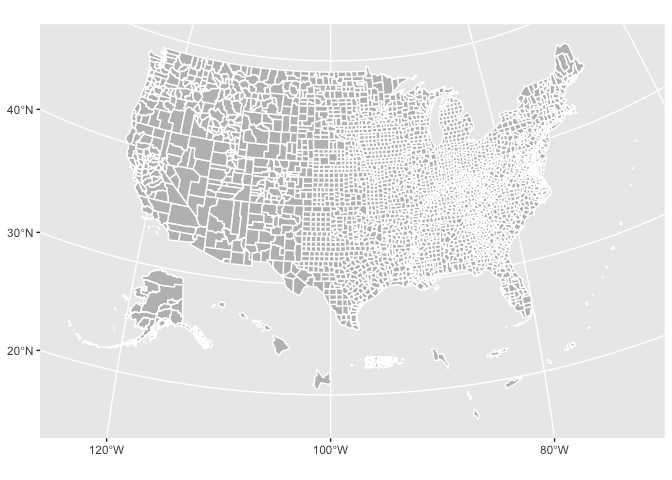
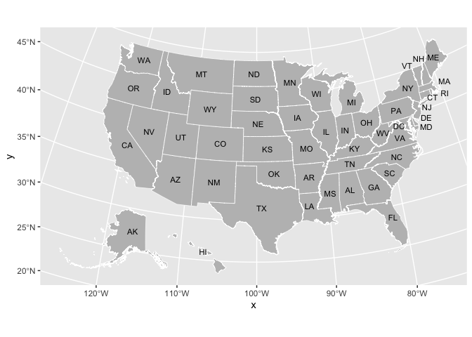
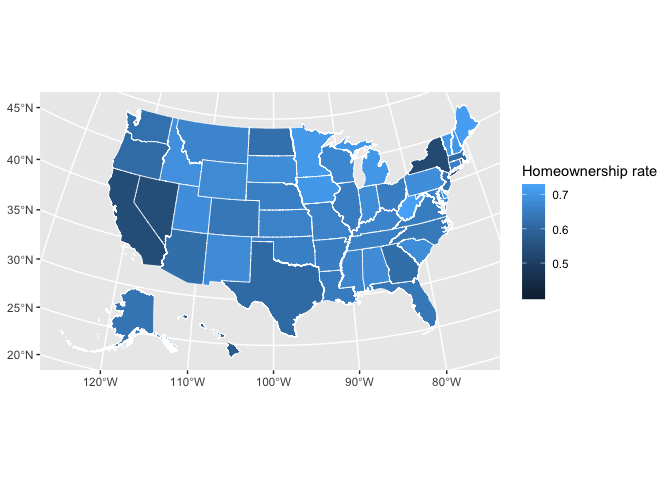

<!-- README.md is generated from README.Rmd. Please edit that file -->

# urbnmapr <a href="https://urbaninstitute.github.io/urbnmapr/"></a>

[](https://travis-ci.org/UrbanInstitute/urbnmapr)

The `urbnmapr` package provides state and county shapefiles that are
compatible to map with `ggplot2`.

Shapefiles include Alaska and Hawaii, transformed to be displayed as
insets within the continental United States. There are options to
include the territories for both the state and county maps.

This package is heavily inspired by and derived in part from the
[fiftystater package](https://cran.r-project.org/package=fiftystater) by
William Murphy. In contrast, `urbnmapr`:

  - Uses shapefiles from the US Census Bureau
  - Converts the shapefile data to `sf` format
  - Adds various identifiers for merging
  - Includes a county-level shapefile and options to add territories

## Stay up-to-date

Sign up
[here](https://app.smartsheet.com/b/form/9029a0a8254e4044a52cdebaebe343bf)
to stay up-to-date with R package releases and R resources from the
Urban Institute. We will not share your information and we will not
email more than once per month.

## Installation

You can install the latest version of `urbnmapr` from GitHub:

``` r
# install.packages("devtools")
devtools::install_github("UrbanInstitute/urbnmapr")
```

## Usage

### Quick maps

The `get_urbn_map()` function can be used to call shapefiles. Using the
`sf = TRUE` option will load `sf` objects. These can be used with
`geom_sf()` to create base maps of the continental United States, with
Alaska and Hawaii displayed as insets:

``` r
library(tidyverse)
library(urbnmapr)

states_sf <- get_urbn_map("states", sf = TRUE)

states_sf %>% 
  ggplot(aes()) +
  geom_sf(fill = "grey", color = "#ffffff")
```

<!-- -->

``` r
library(tidyverse)
library(urbnmapr)

counties_sf <- get_urbn_map("counties", sf = TRUE)

counties_sf %>% 
  ggplot(aes()) +
  geom_sf(fill = "grey", color = "#ffffff")
```

<!-- -->

The default projection is US National Atlas Equal Area.

### More maps

Maps with US territories can also be called with
`get_urbn_map()`.

``` r
territories_counties <- get_urbn_map(map = "territories_counties", sf = TRUE)

ggplot() +
  geom_sf(territories_counties,
          mapping = aes(),
          fill = "grey", color = "#ffffff")
```

<!-- -->

### Labels

Labels for states maps can be accessed with `get_urbn_labels()`. Only
state labels are custom, so they can be displayed next to smaller
states. Use the function to call the appropriate labels and then label
the map with `geom_sf_text()`.

``` r
states_sf <- get_urbn_map(map = "states", sf = TRUE)

states_sf %>%
  ggplot() +
  geom_sf(aes(), 
          fill = "grey", color = "#ffffff", size = 0.25) +
  geom_sf_text(data = get_urbn_labels(map = "states", sf = TRUE), 
                aes(label = state_abbv), 
            size = 3)
```

<!-- -->

## Merging Data

The states and counties spatial data include various identifiers to
simplify merging data. The states `states` tibble contains `state_fips`,
`state_abbv`, and `state_name`. The `counties` tibble contains
`county_fips`, `state_abbv`, `state_fips`, `county_name`, and
`state_name`.

Continuous data can be mapping on a color scale.

``` r
spatial_data <- left_join(get_urbn_map(map = "states", sf = TRUE),
                          statedata,
                          by = "state_name")

ggplot() +
  geom_sf(spatial_data,
          mapping = aes(fill = horate),
          color = "#ffffff", size = 0.25) +
  labs(fill = "Homeownership rate")
```

<!-- -->

Categorical data can be mapped on a discrete color scale.

``` r
counties_sf <- get_urbn_map(map = "counties", sf = TRUE)
county_groups <- countydata %>% 
  mutate(cat_var = paste0("Group ",
                          sample(1:4, nrow(countydata), replace = TRUE)))

household_data <- left_join(counties_sf, county_groups, by = "county_fips")

household_data %>%
  ggplot() +
  geom_sf(mapping = aes(fill = cat_var),
          color = NA, size = 0.05) +
  labs(fill = "Categorical variable")
```

<!-- -->

## Styles

`library(urbnmapr)` works well with
[\`library(urbnthemes)](https://github.com/UrbanInstitute/urbnthemes)

``` r
library(urbnthemes)

set_urbn_defaults(style = "map")
```

    ## Warning: New theme missing the following elements: axis.ticks.length.x,
    ## axis.ticks.length.x.top, axis.ticks.length.x.bottom, axis.ticks.length.y,
    ## axis.ticks.length.y.left, axis.ticks.length.y.right

``` r
states_sf <- get_urbn_map(map = "states", sf = TRUE)

states_sf %>% 
  left_join(statedata, by = "state_name") %>% 
  ggplot() +
  geom_sf(mapping = aes(fill = horate),
          color = "#ffffff", size = 0.25) +
  scale_fill_gradientn(labels = scales::percent) +
  labs(fill = "Homeownership rate") +
  coord_sf(datum = NA)
```

<!-- -->

Map smaller geographies with `filter()`. You may need to reproject the
data based on which areas you are mapping.

``` r
household_data %>%
  filter(state_name == "California") %>%
  ggplot() +
    geom_sf(mapping = aes(fill = medhhincome),
                 color = "#ffffff", size = 0.05) +
    coord_sf(datum = NA) +
    scale_fill_gradientn(labels = scales::dollar) +
  labs(fill = "Median household income")
```

<!-- -->

A discrete color scale can also be used for categorical data.

``` r
state_categorical <- left_join(get_urbn_map(map = "states", sf = TRUE),
                               statedata,
                               by = "state_name") %>% 
  mutate(cat_var = paste0("Group ",
                          sample(1:4, nrow(statedata), replace = TRUE)))


ggplot() +
  geom_sf(state_categorical, mapping = aes(fill = cat_var),
          color = "#ffffff") +
  scale_fill_discrete() +
  coord_sf(datum = NA) +
  labs(fill = "Categorical variable")
```

<!-- -->

## License

Code released under the GNU General Public License v3.0.

## Code of conduct

Please note that this project is released with a [Contributor Code of
Conduct](CODE_OF_CONDUCT.md). By participating in this project you agree
to abide by its terms.
